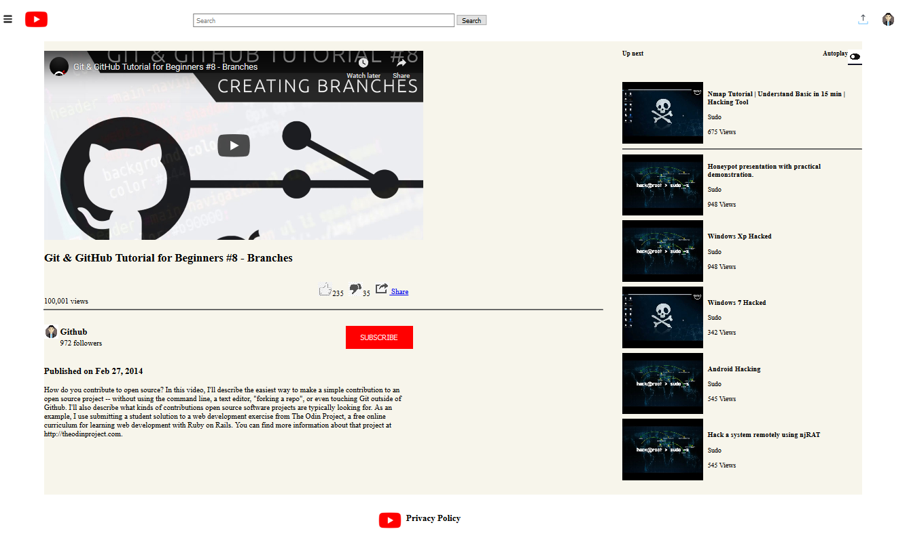

#You Tube Home Page / Embedding Images & Video

This is the clone for YouTube homepage for embedding images & videos using basic HTML and CSS features.

    

#Technologies Used:

-HTML
-CSS
-VS Code Editor

#Live Version:

https://github.com/yigitm/You_Tube_Video_Player

Authors:

Dipesh Kumar

Github: @Dipeshtwis
Twitter: @97deepeshkumar
Linkedin: linkedni : https://www.linkedin.com/in/dipesh-kumar-b6ab88134/

Yiğit Mersin

Github: @yigitm
Twitter: @ygtmrsn
Linkedin: https://www.linkedin.com/in/yigitmersin

Show your support
Give a ⭐️ if you like this project!
